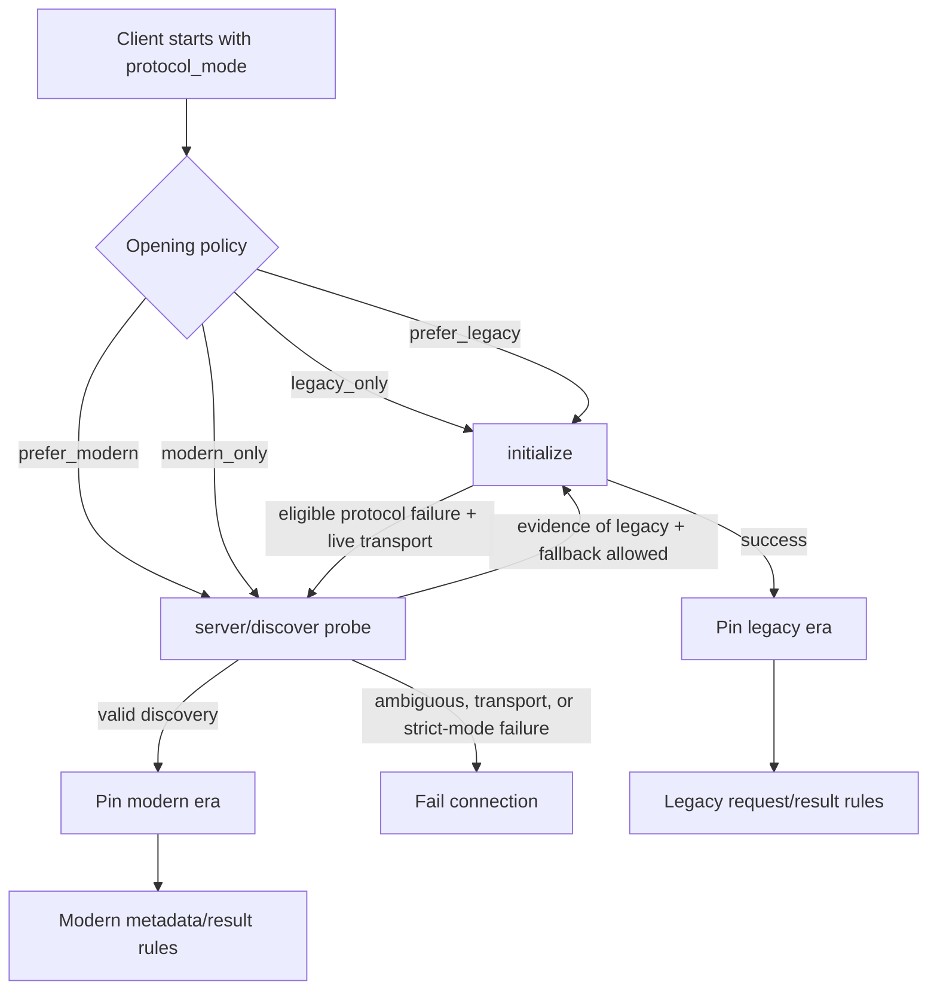

# ArborMCP Architecture Guide

ArborMCP is organized around protocol boundaries: clients, servers, transports,
HTTP Plug integration, authorization, and internal protocol helpers. Public
APIs stay small; cross-cutting work is kept at transport or Plug boundaries.

Version 2 implements per-server runtime ownership and bounded callback
scheduling across HTTP, stdio, BEAM and test transports. The source is available in the published `2.0.0-rc.2` candidate. Start with the [runtime guide](RUNTIME_GUIDE.md)
for supervision, limits and shutdown, and the
[migration guide](guides/MIGRATING_V1_TO_V2.md) for changes from ExMCP 1.x.

## Public Layers

### MCP Client

`Arbor.MCP.Client` owns the client process, protocol-era establishment, request
IDs, server capability state, retries, and request/response formatting.

Client operation modules under `lib/arbor_mcp/client/operations/` keep tool,
resource, and prompt calls focused while `Arbor.MCP.Client.ConnectionManager`
normalizes transport startup.

### MCP Server

Server implementations use `Arbor.MCP.Server.Handler`. Most applications should add
`Arbor.MCP.Server.DSL` for declarative tools, resources, and prompts:

```elixir
defmodule MyServer do
  use Arbor.MCP.Server.Handler
  use Arbor.MCP.Server.DSL

  tool "echo", "Echo input" do
    param :message, :string, required: true

    run fn %{message: message}, state ->
      {:ok, %{content: [%{type: "text", text: message}]}, state}
    end
  end
end
```

`Arbor.MCP.Server.Runtime` supervises the handler scheduler, scoped services,
transport edge and owned work. Stateful callbacks run serially in supervised
workers; explicit stateless mode permits bounded concurrency without state
updates. Admission reserves count and byte capacity before queuing payloads.

`Arbor.MCP.Server.HandlerServer.start_link/1` and the DSL-generated
`start_link/1` return a Runtime supervisor PID. HandlerServer is the BEAM/test
protocol edge, not the handler state owner. HTTP and stdio dispatch through
the same Runtime. Client connections and HTTP listeners have their own
ownership rules; starting a client against a server does not transfer
ownership of that server.

### Transports

Transport modules implement `Arbor.MCP.Transport`:

- `Arbor.MCP.Transport.Stdio` for newline-delimited JSON-RPC over subprocess stdio.
- `Arbor.MCP.Transport.HTTP` for legacy and modern Streamable HTTP. Legacy
  revisions may use a standalone GET SSE stream; modern SSE belongs to its
  originating POST.
- `Arbor.MCP.Transport.Local` for BEAM-local MCP maps/lists passed as Elixir terms.
- `Arbor.MCP.Transport.Test` for in-memory tests.

BEAM-local MCP is selected with `transport: :beam` and requires a server PID:

```elixir
{:ok, server} = MyServer.start_link(transport: :beam)  # or HandlerServer.start_link(handler: MyHandler, ...)
{:ok, client} = Arbor.MCP.Client.start_link(transport: :beam, server: server)
```

The removed `:native` alias and direct dispatcher API are not part of the v2
public architecture.

### HTTP Plug

`Arbor.MCP.HttpPlug` is the HTTP server boundary. Request parsing, session
resolution, CORS/origin handling, response shaping, and SSE handling are split
under `lib/arbor_mcp/http_plug/`.

Use normal Phoenix/Plug composition for HTTP edge concerns:

```elixir
# In Application.start/2, before the borrowed Phoenix endpoint:
children = [
  {Arbor.MCP.Server.Runtime,
   name: MyApp.MCPRuntime,
   handler: MyApp.MCPServer,
   handler_args: [],
   transport: :mounted_http}
]
Supervisor.start_link(children, strategy: :one_for_one)

# In the router:
pipeline :mcp do
  plug Arbor.MCP.Plugs.DnsRebinding
  plug MyApp.AuthenticateMCP
end

scope "/mcp" do
  pipe_through :mcp

  forward "/", Arbor.MCP.HttpPlug,
    runtime: MyApp.MCPRuntime
end
```

### Package boundaries

This package contains MCP clients, servers and transports. ACP clients, native
agents and optional vendor adapters live in
[ArborACP](https://github.com/trust-arbor/arbor_acp).

The [ArborRPC](https://github.com/trust-arbor/arbor_rpc) dependency owns shared
JSON-RPC decoding, framing, environment policy and bounded native subprocess
lifetimes. MCP era negotiation, resource validation and protocol semantics
remain in this package. The optional `arbor_acp_adapters` package supplies
vendor integrations without adding them to MCP or ACP core.

## Protocol Era Model

ArborMCP treats MCP 2025-11-25 and earlier as the **legacy era** and MCP
2026-07-28 as the **modern era**. This is an architectural boundary, not just a
version comparison: handshake, metadata, result envelopes, notifications, and
HTTP state all change together. A connection is established in one era and is
never allowed to mix wire shapes afterward.



The four modes are intentionally policies rather than protocol versions:

| Mode | Enabled eras | Client opens with | Automatic fallback |
|---|---|---|---|
| `:legacy_only` | Legacy | `initialize` | Never |
| `:prefer_legacy` | Both | `initialize` | To modern only after an eligible protocol failure on a live transport |
| `:prefer_modern` | Both | `server/discover` | To legacy only with positive compatibility evidence on a live transport |
| `:modern_only` | Modern | `server/discover` | Never |

On the server, both `:prefer_legacy` and `:prefer_modern` accept either era;
the preference controls advertised version ordering. HandlerServer and stdio
connections pin on a valid modern request or legacy `initialize`. HTTP remains
stateless in the modern era, so `Arbor.MCP.Server.RequestContext` derives and
validates the era on each request instead.

### Era responsibilities

- Arbor.MCP.Internal.VersionRegistry is the source of truth for known revisions,
  their era, enabled versions, and preference order. The zero-arity
  `Arbor.MCP.protocol_version/0` helper returns the newest legacy revision,
  `2025-11-25`, for initialize-based compatibility.
- `Arbor.MCP.Client.ConnectionManager` applies the selected policy.
  `Arbor.MCP.Client.EraProbe` owns the bounded, side-effect-free
  `server/discover` probe.
- `Arbor.MCP.Client.EraCache` keys observations by transport identity. Modern
  observations do not expire and cannot be replaced by automatic downgrade;
  legacy observations expire so an upgraded peer is eventually probed again.
- `Arbor.MCP.Server.RequestContext` separates modern `_meta` from application
  parameters, validates the configured mode and method availability, and
  exposes a single context to dispatch.
- `Arbor.MCP.Protocol.ResultEnvelope` enforces modern `resultType` while preserving
  the legacy result shape. MRTR continuation state, cache hints, subscriptions,
  and modern Tasks remain protocol-layer concerns rather than transport state.
- Transports implement era-specific framing only. When HTTP settles modern it
  discards legacy session state and disables the standalone GET stream.

This separation prevents a failed modern probe from becoming an unsafe silent
downgrade. Fallback requires both a recognized compatibility signal and a
still-usable transport. A cached modern peer failing its next probe is surfaced
as an error until the operator clears that observation or changes policy.

## Internal Functional Cores

Pure transformation and validation logic is kept separate from process and I/O
boundaries:

- Internal protocol and version modules handle message construction, parsing,
  and version rules.
- The message processor modules provide a Plug-like processing pipeline for
  server request dispatch.
- `Arbor.MCP.Content.*` modules normalize content, sanitize inputs, and validate
  schema-related data.
- Shared RPC framing and environment helpers keep byte handling separate from
  MCP protocol semantics.

This structure keeps side effects at the edges: GenServers, Ports, HTTP
requests, Plug connections, filesystem-backed session stores, and telemetry.

## Resilience And Pipelines

ArborMCP currently has three pipeline-style boundaries:

- HTTP server requests: normal Plug/Phoenix pipelines around `Arbor.MCP.HttpPlug`.
- Server message processing: `Arbor.MCP.MessageProcessor.run/2` for internal
  Plug-like request processing.
- Transport reliability: `Arbor.MCP.Transport.ReliabilityWrapper`, client
  `retry_policy`, and `Arbor.MCP.Reliability.*` components.

HTTP client connection handling is transport-owned today. If ArborMCP later adds a
public client middleware API, it should wrap request construction and transport
send/receive at the `Arbor.MCP.Client` boundary rather than inside HTTP-specific
code, so stdio, HTTP, and BEAM-local can share the same cross-cutting behavior.

## Module Map

```text
lib/arbor_mcp/
  authorization/       OAuth 2.1 and auth provider flows
  client/              Client operations, handlers, state, connection setup
  content/             Content builders, validation, sanitization
  http_plug/           HTTP Plug functional core and SSE handling
  internal/            Private protocol, era/version, map, and security helpers
  message_processor/   Plug-like MCP request processing
  plugs/               Reusable Plug security/auth components
  protocol/            Public protocol utility modules
  reliability/         Retry, circuit breaker, health check supervisor
  runtime/             Per-server admission, scheduling, services and shutdown
  runtime.ex           Public Runtime supervisor and lifecycle API
  server/              Handler behavior, DSL, transport startup
  transport/           Stdio, HTTP, BEAM-local, test transports
```

## Testing Architecture

The test suite covers unit, integration, interop, conformance, security, and
transport behavior. `Arbor.MCP.Transport.Test` and `transport: :beam` keep local
server/client tests fast without starting subprocesses or network listeners.

External conformance scripts live in `scripts/` and should be run for each
supported MCP spec version before release:

```bash
./scripts/conformance.sh              # published legacy/core harness
./scripts/conformance.sh all-versions # all negotiated legacy MCP versions
./scripts/conformance.sh modern       # gating 2026-07-28 complete suites
./scripts/conformance.sh draft-alpha  # non-gating future-draft exploration
mix mcp.sync_spec --version 2026-07-28 --force  # refresh local docs/mcp-specs
```

### Protocol version alignment

| Protocol era | Revisions | Current MCP implementation |
|---|---|---|
| MCP legacy | `2024-11-05`, `2025-03-26`, `2025-06-18`, `2025-11-25` | Enabled by `:legacy_only` and both preference modes |
| MCP modern | `2026-07-28` (latest stable) | Implemented; enabled by `:modern_only` and both preference modes |

## Design Rules

- Prefer `Arbor.MCP.Server.Handler` plus `Arbor.MCP.Server.DSL` for servers.
- Select an explicit protocol mode in deployments and tests; never infer an
  era solely from a method name after a connection has pinned.
- Keep compatibility fallback in `Arbor.MCP.Client.ConnectionManager` and
  `Arbor.MCP.Client.EraProbe`; application operations must not implement their own
  modern-to-legacy retry.
- Use `transport: :beam` for local BEAM MCP, not a separate service dispatcher.
- Put HTTP authorization, origin, and request-signing checks in Plug pipelines.
- Put transport failure handling in client retry/reliability options.
- Keep pure protocol transformations in functional modules and side effects in
  GenServer, Port, Plug, or filesystem boundaries.
- Configure handler state and stores through the Runtime; use supported
  request/helper APIs so work participates in admission and cleanup accounting.
