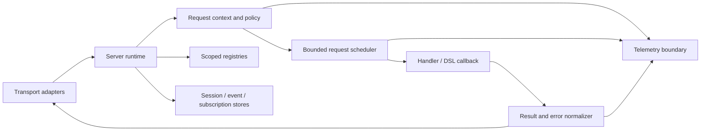

# ArborMCP v2 and ArborACP v1 Roadmap

- **Status:** Accepted v2 implementation complete; audit fixes and release qualification in progress
- **Target:** ArborMCP 2.0 / ArborACP 1.0 release, Friday 2026-10-09, after qualification and RC soak
- **Last updated:** 2026-10-07
- **Related release work:** [`RELEASE_1_0_0.md`](./RELEASE_1_0_0.md),
  [`API_DIFF_RC5_TO_1_0.md`](./API_DIFF_RC5_TO_1_0.md),
  [`POST_1_0_MAINTENANCE_PLAN.md`](./POST_1_0_MAINTENANCE_PLAN.md),
  [`ACP_V2_TRACKING.md`](./ACP_V2_TRACKING.md),
  [`MCP_2026_07_28_MIGRATION_PLAN.md`](./MCP_2026_07_28_MIGRATION_PLAN.md),
  [`V2_RELEASE_ASSESSMENT.md`](./V2_RELEASE_ASSESSMENT.md),
  [`V2_API_BASELINE.md`](./V2_API_BASELINE.md),
  [`V2_API_MIGRATION.md`](./V2_API_MIGRATION.md),
  [`V2_PACKAGE_CONTRACT.md`](./V2_PACKAGE_CONTRACT.md),
  [`V2_RUNTIME_CONTRACT.md`](./V2_RUNTIME_CONTRACT.md),
  [`V2_RELEASE_PLAN.md`](./V2_RELEASE_PLAN.md)

---

## Current scope and release status — October 7, 2026

The accepted architectural scope is implemented: independent MCP, ACP and RPC
projects; the optional adapter bundle and HTTP listeners; per-server Runtime
ownership; common dispatch and bounded scheduling; scoped stores; unified
results; DSL constraints/composition; `with_connection`; API retirements and
migration guidance. The delivery phases and dated decisions below preserve the
planning history, not a list of features still awaiting implementation.

All four original `2.0.0-rc.1` packages are published and their archive
checksums were verified. Current source prepares MCP `2.0.0-rc.2` and RPC,
ACP and Adapters `1.0.0-rc.1`, with independent 1.x dependency requirements.
The replacements are not yet published. Preserve existing versions and tags;
retirement follows verified replacement installation.

The accepted package split and runtime/scheduler scope is implemented. Optional
HTTP dependency ranges, Claude file limits and ZCode settings fixes passed their
recorded checks. Supported/latest MCP CI passed at `0812257`; ACP and RPC retain
their own recorded source selections. Prior receipts do not qualify new metadata.

Further performance investigation is deferred at the user's request. Adopted
encoder/accounting and revision-token changes remain; mixed experimental changes
are not promoted. Document measured performance costs for the stable decision.
The [DSL/Spark and public API review](V2_DSL_API_REVIEW.md) records remaining
facade bridges, shutdown/fallback inconsistencies and DSL validation proposals
before the release freeze. Those API changes are not yet implemented.

Remaining gates are final metadata/source/archive association, applicable CI,
conformance/SDK/CLI and dependency-contract checks, real downstream integrations,
long-lived peer capacity policy, registry installation and the final candidate's
continuous 48-hour soak. No qualifying soak is active; stable qualification is
incomplete. See [RC notes](guides/V2_RELEASE_CANDIDATE.md) for consumer limits.

See the [release plan](V2_RELEASE_PLAN.md#current-release-status--october-7-2026).

ExMCP 1.x remains maintained on `codex/maintenance-1.x`, preserved from
`3914a927`. Compatible fixes require their own 1.x qualification; the v2 split,
namespace changes, scheduler and API removals are not wholesale backports. The
[maintenance policy](MAINTENANCE_POLICY.md) governs the two release lines.

The earlier design questions now resolve to serialized stateful or explicit
stateless execution, opaque Runtime/service references, scoped store contracts,
retained legacy protocol support, and compile-time DSL composition. Package and
adapter ownership are implemented. Public middleware and a general dialect
framework remain deliberately deferred; distributed databases/event sourcing
remain outside core scope. No hot-upgrade guarantee is introduced.

## 1. Purpose

ExMCP 1.0 establishes a dual-era MCP implementation with a broad, compatible
public API. ExMCP 2.0 should make that implementation easier to operate,
extend, and reason about without turning the major release into an unrelated
rewrite.

This roadmap records:

- the changes intentionally reserved for a major release;
- which ideas from Anubis MCP and the external Grok review are being adopted;
- which ideas are useful only with constraints, and which are rejected;
- the order in which the runtime, dispatch, storage, and public API should
  evolve; and
- the rules for safely backporting selected work to 1.x.

It is the canonical ArborMCP and ArborACP 2.0 planning document. The similarly named
[`PRE_2_0_TECH_DEBT_PLAN.md`](./PRE_2_0_TECH_DEBT_PLAN.md) is completed rc.5
release history, not the 2.0 roadmap.

ACP protocol v2 is a separate upstream wire-version effort. Its monitoring,
versioned protocol boundaries, and adoption gates are recorded in
[`ACP_V2_TRACKING.md`](./ACP_V2_TRACKING.md); ExMCP `2.0.0` neither implies nor
requires ACP `protocolVersion: 2`.

## 2. Inputs are evidence, not specifications

The roadmap uses three inputs:

1. ExMCP's current architecture, tests, deprecations, and 1.0 release gates.
2. [Anubis MCP](https://github.com/zoedsoupe/anubis-mcp), especially its
   smaller public surface, component boundaries, supervision-oriented design,
   and developer ergonomics.
3. The [Grok design review](https://grok.com/share/bGVnYWN5LWNvcHk_ce15b5ae-1f64-406c-b65e-df2b934e53ba),
   which proposed improvements around dispatch, handler scheduling, result and
   schema helpers, persistence adapters, protocol boundaries, telemetry, and
   client ergonomics.

Neither external project defines ExMCP's compatibility contract. Ideas are
accepted only when they solve an observed ExMCP problem and fit OTP, MCP wire
compatibility, and the maintenance cost of a multi-transport library. ExMCP
will not copy another library's public API merely to look familiar.

### Accepted release scope (2026-10-03)

The v2 release includes the per-server runtime, unified dispatch and bounded
handler scheduler alongside the package split, optional HTTP dependencies,
public API cleanup and migration qualification. Runtime ownership, callback
execution, cancellation and state-ordering changes must be designed and
qualified before the first v2 RC; they are not deferred to v3 or treated as
future 2.x minor work. Supporting configuration, store and result contracts
remain prerequisites in the delivery phases below.

The optional ACP vendor-adapter split was accepted on 2026-10-03: keep one
generic adapter framework in ACP and package the Claude, Codex, Pi and ZCode
implementations together in `arbor_acp_adapters`, alongside `arbor_acp` in the
ACP repository. Adapter support and lowest/newest core compatibility contracts
are prerequisites for independent releases.

Public namespaces `Arbor.MCP.*` and `Arbor.ACP.*` and the October 9 target were
accepted on 2026-10-03. With explicit approval, the existing repository was
transferred to `trust-arbor/arbor_mcp`; its identity, history, releases and old
URL redirect were verified. MCP development continues there. The ACP
repository will hold the core and optional adapter package. New Hex packages
and consumer migration wait for qualified artifacts. Package ownership and
shared mechanics are specified in [V2_PACKAGE_CONTRACT.md](./V2_PACKAGE_CONTRACT.md).

The ACP repository now exists at
[`trust-arbor/arbor_acp`](https://github.com/trust-arbor/arbor_acp). Its core and
adapter projects have independent toolchain checks. Shared mechanics live in the
separate [ArborRPC repository](https://github.com/trust-arbor/arbor_rpc), with its
Mix project at the repository root. MCP v2
is developed in [draft PR #76](https://github.com/trust-arbor/arbor_mcp/pull/76),
and shared child-process convergence in
[ACP draft PR #1](https://github.com/trust-arbor/arbor_acp/pull/1). Supported
MCP `master` remains the `ExMCP` 1.x implementation. No v2 package is published.
The [release assessment](./V2_RELEASE_ASSESSMENT.md) distinguishes committed
foundations, local integration candidates and outstanding release gates.

## 3. Guiding constraints

### 3.1 Preserve protocol capability

The 2.0 package version and MCP protocol revisions are separate compatibility
boundaries. A public Elixir API redesign does not justify losing modern MCP
conformance or silently dropping legacy protocol support.

Any removal of a legacy MCP revision or deprecated protocol feature requires a
separate decision with usage evidence, notice, and migration guidance. It is
not an automatic consequence of releasing ExMCP 2.0.

### 3.2 Prefer one runtime owner

A started MCP server should own its registries, handler execution, session and
subscription state, replay store, and telemetry identity through one
supervision subtree. Process-global state makes multiple servers in one VM
hard to isolate and obscures restart behavior.

### 3.3 Keep concurrency bounded and explicit

Running every handler in an unlinked task would improve throughput while
weakening cancellation and state guarantees. ExMCP should use supervised,
bounded work and define state-commit semantics before enabling concurrent
callbacks.

Stateful handlers remain serialized by default. Concurrent execution is for
handlers that explicitly select a stateless, re-entrant, or otherwise isolated
state model.

### 3.4 Make side effects replaceable, not mandatory

The core should define small store contracts for state that must outlive a
connection. ETS remains a useful default. Durable or clustered implementations
should be replaceable adapters rather than database dependencies in the core
package.

### 3.5 Spend the breaking-change budget deliberately

The major release should remove deprecated APIs, clarify ownership, and
regularize callback/result contracts. Cosmetic renames, duplicate aliases, and
speculative abstraction consume migration effort without producing the same
value.

### 3.6 Use functional cores inside OTP-owned shells

Processes should own mutable state and effects, but they need not own every
decision. Model request, session, retry, dispatch, and protocol transitions as
pure reducers where that produces a coherent semantic boundary. Reducers
receive time, identifiers, and normalized configuration explicitly and return
new state plus tagged effects for the owning process to execute.

This is not a mandate to turn every helper into a module or to replace OTP with
an application framework. The objective is to make ordering, cancellation,
expiry, and error decisions testable without a running process while leaving
Ports, ETS, HTTP, `Plug.Conn`, telemetry, logging, and supervision at the edge.

## 4. Released baseline and current mainline

The 1.0 line already provides:

- dual-era MCP support through explicit protocol modes;
- a canonical method registry and shared server dispatch primitives;
- `ExMCP.Server.Handler` and `ExMCP.Server.DSL` as the preferred server APIs;
- modern request context, result envelopes, MRTR, subscriptions, and Tasks;
- stdio, Streamable HTTP, legacy HTTP+SSE, BEAM-local, and test transports;
- ACP client, agent, and adapter support; and
- conformance, characterization, property, security, and interoperability
  coverage.

Stable `v1.0.0` was published on 2026-08-22 after the final `1.0.0-rc.8`
candidate completed a one-week soak. The release includes dual-era MCP,
legacy SSE persistence end to end, the 2026-08-12 security hardening, and the
credential-free Claude SDK, Codex, and Pi CLI lifecycle suite. The stable tag
also contains the deterministic OAuth callback field-lookup fix described in
the release record; it does not change the rc.8 public or wire surface.

The public API census is recorded in
[`API_DIFF_RC5_TO_1_0.md`](./API_DIFF_RC5_TO_1_0.md), and committed protocol
fixtures pin capability and initialize behavior across supported revisions.
The mixed-version rollback drill, modern conformance suites, official SDK v2
interop, security checks, and performance/load gates provide the remaining
release evidence.

The latest published baseline is `v1.5.0` (2026-09-21). It includes the ZCode
ACP adapter, the four-adapter real-CLI lifecycle suite, stdio byte framing,
legacy notification delivery, and the Codex/Pi/HTTP internal restructuring
recorded in the backport table below. These are not retroactive contents of
the `v1.0.0` artifact.

Work after `v1.5.0` includes Pi and Claude characterization/refactoring,
Claude mode/quota/fork/message-ID support, split-preparation tooling (#71),
bounded OS trust-store loading (#74), downstream client lifecycle/security
fixes (#72), and the Claude launch-time MCP config/capability correction
(`e4d2fc3`). The package still declares `1.5.0` and contains both protocols;
none of this establishes a released split or a completed architectural v2.
The 2026-10-03 assessment records the branch reconciliation, local extraction
prototype, and remaining qualification work.

The remaining architectural pressure is concentrated in runtime ownership,
callback execution, storage contracts, duplicated public concepts, and the
size of the compatibility surface.

## 5. Decision register

| Idea | Source | Decision | Target | Rationale |
|---|---|---|---|---|
| Per-server runtime and scoped registries | Anubis comparison; ExMCP review | Adopt | 2.0 | Makes ownership, multi-server isolation, restart behavior, and testing explicit. |
| Pure transition cores with effectful OTP shells | ExMCP architecture review | Adopt with constraints | Post-1.0 foundation; complete in 2.0 | Extract cohesive state machines, inject ambient inputs, and preserve process ownership and observable lifecycle. |
| Validated configuration structs | ExMCP architecture review | Adopt | 2.0 | Resolve application/system environment and defaults once; stop deep code from rediscovering precedence. |
| Supervised handler scheduler | Grok review | Adopt with constraints | 2.0 | Use bounded `Task.Supervisor` work, cancellation propagation, and explicit state semantics; never fire-and-forget tasks. |
| One dispatch/context/result pipeline | Both reviews; existing ExMCP drift | Adopt | 2.0 foundation | All transports should observe the same authorization, timeout, telemetry, normalization, and error behavior. |
| Event and session store behaviours | Grok review; SSE implementation | Adopt | Design in 2.0; adapter may later backport | ETS remains the default; append/replay/TTL/delete semantics must be specified before adapters are public. |
| Small result-construction API | Anubis comparison; Grok review | Adopt | 2.0 | Consolidate result helpers and normalizers instead of adding another parallel facade in 1.x. |
| Richer DSL parameter constraints | Both reviews | Adopt selectively | 2.0 | Add high-value JSON Schema constraints without trying to reproduce the entire schema vocabulary as macros. |
| Client `with_connection` lifecycle helper | Grok review | Adopt | 2.0 | Useful ergonomics, but it should be designed with ownership, links, shutdown, and reconnect behavior together. |
| Component grouping and composition | Anubis comparison | Adopt with constraints | 2.0 | Prefer compile-time composition and scoped runtime registration; avoid a second DSL or unconstrained global component registry. |
| Central additive telemetry | Grok review | Adopt | 1.x-compatible subset, complete in 2.0 | Instrument the shared dispatch boundary; payload capture stays opt-in and bounded. |
| Public middleware/pipeline API | Grok review | Defer | Reconsider after internal pipeline lands | First prove stable phases and use cases internally; a premature public pipeline becomes another compatibility surface. |
| General protocol-dialect framework | Grok review | Defer | Only with two concrete consumers | Keep existing era/version modules unless a second protocol family demonstrates that a general dialect abstraction removes real duplication. |
| Optional HTTP server dependency (Cowboy optional, Bandit supported) | Cowlib advisory tracking (#18); PR #21 | Adopt | 2.0, alongside runtime/scheduler redesign | `EEF-CVE-2026-43966` and `EEF-CVE-2026-43969` are "won't fix" upstream, so every consumer carries audit exceptions for encoders ExMCP never calls. Standalone `transport: :http` would require the host to add Bandit or Cowboy, which breaks 1.x consumers; Phoenix mounts of `ExMCP.HttpPlug` are unaffected. Listener lifecycle goes behind per-adapter modules; `:ranch_ref`, the named listener, and shutdown semantics are preserved where Cowboy is chosen. |
| Separate MCP and ACP Hex packages | Package-footprint review | Implementing; initial independent packages tested | 2.0 | Arbor repository ownership is settled; fresh core/adapter/RPC extraction passes tests and archive inspection. Shared subprocess convergence, final namespaces, compatibility and release qualification remain gates. |
| Optional ACP vendor-adapter package | 2026-10-03 package review | Adopt; extension contract in progress | 2.0 | Keep the generic adapter framework in ACP; move vendor implementations to one optional bundle in the ACP repository with a separate release cadence and explicit core compatibility ranges. |
| Neutral shared RPC package | Package-footprint and lifecycle review | Adopt; implemented candidate | 2.0 | `arbor_rpc` owns JSON-RPC/framing/environment and owned subprocess mechanics used by MCP and ACP. Final ABI/default and platform/pressure qualification remain release gates. |
| Built-in distributed database/event sourcing | External review extrapolation | Reject for core | External adapters | ExMCP should define contracts, not require a database or event-source all runtime state. |
| Copy Anubis APIs or rewrite ExMCP around them | Comparison exercise | Reject | — | ExMCP has broader protocol, transport, authorization, ACP, and compatibility requirements. |
| Treat every additive API as a safe 1.x backport | Backport discussion | Reject | — | Additions create support obligations and can still change lifecycle, defaults, ordering, or wire behavior. |
| Remove every legacy MCP feature in 2.0 | Version-number assumption | Reject as a default | Separate decision | Package-major and protocol-version policies are independent. |

## 6. Target runtime shape

The target is one server-owned supervision subtree with a common dispatch
boundary. Transport-specific framing stays at the edges.



The runtime reference, not a global registered name, should identify a server
instance. Convenience startup may still provide a default name, but core code
must accept an explicit runtime or server reference.

### Runtime-owned children

A server runtime should own, as applicable:

- the handler state owner;
- the bounded request task supervisor and scheduler;
- session and SSE-handler registration;
- event replay storage;
- subscription indexes and optional cluster fanout;
- request-state/replay caches;
- transport listeners; and
- a stable telemetry identity.

Failures must have a documented blast radius. Restarting a transport listener
must not silently discard an independently configured durable event store, and
a failed request task must not terminate unrelated requests or another server
instance.

## 7. Delivery phases

Phases are dependency ordered. A later phase may be prototyped early, but it
does not merge to the 2.0 release branch until its prerequisites pass.

### Phase 0 — Finish and freeze the 1.0 baseline

**Goal:** establish the exact behavior from which 2.0 migrates.

**Status: Complete (2026-08-22).**

- `v1.0.0` was tagged at `e1e7e7a` and published as a stable GitHub release
  and Hex package after the one-week rc.8 soak and final release gates passed.
- The stable release preserves rc.8's public API, wire behavior, and protocol
  defaults while adding only the characterized OAuth callback correctness fix.
- The API census, protocol capability and initialize fixtures, release record,
  conformance results, official-SDK interoperability, security evidence,
  performance/load gates, and mixed-version rollback drill form the durable
  1.0 comparison baseline.
- Post-release ZCode adapter and real-CLI coverage are explicitly tracked as
  additive 1.x work rather than being folded into the historical 1.0 artifact.

**Exit achieved:** stable `1.0.0` is published, and its public and wire
characterization evidence is committed as the 2.0 comparison baseline. Phase 1
should turn the existing API census into a reproducible machine-readable
manifest before proposing removals.

### Phase 1 — Specify the 2.0 contract before moving code

**Goal:** make breaking changes reviewable rather than emergent.

- Inventory documented modules, exports, callbacks, types, structs, options,
  process names, telemetry, and wire-visible defaults.
- Publish the proposed removal and replacement table.
- Write focused decision records for runtime ownership, handler state and
  concurrency, store contracts, and legacy-protocol support.
- Add characterization tests for callback process identity, links, timeout and
  cancellation behavior, state ordering, and per-server isolation.
- Define the migration path for every removal before deleting it.
- Decide package topology, namespaces, dependency direction, version policy,
  and whether existing `ExMCP.ACP.*` modules move or remain compatibility
  namespaces.
- Define validated configuration structs and preserve the 1.x precedence table
  as an explicit migration contract.
- Specify reducer/action ordering, effect-failure feedback, correlation and
  idempotency, late/duplicate event handling, and timer/cancellation races.
  Keep reducer action schemas private unless deliberately accepted as public.

**Exit:** maintainers can answer what breaks, why it breaks, and how users
migrate without referring to implementation diffs.

### Phase 2 — Introduce `ExMCP.Server.Runtime`

**Goal:** replace process-global ownership with one explicit server boundary.

- Add a runtime child specification and stable runtime reference.
- Move registries, sessions, subscriptions, and request caches under the
  server's supervisor.
- Allow multiple independent server runtimes in one VM without key collisions
  or shared cleanup.
- Define restart strategies and ownership of external adapter processes.
- Keep transports thin: they resolve a runtime and submit framed requests.

**Exit:** isolation tests can start, crash, restart, and stop two servers
independently; no request/session/subscription state crosses the boundary.

### Phase 3 — Unify dispatch and add bounded scheduling

**Goal:** make every transport use the same request semantics.

- Route stdio, HTTP, BEAM-local, and test requests through one dispatch entry.
- Express dispatch/request lifecycle as a pure transition core where practical;
  the runtime executes returned transport, reply, timer, and telemetry actions.
- Centralize request context, authorization outcome, method lookup, deadlines,
  telemetry, result normalization, and error mapping.
- Execute eligible callbacks through a runtime-owned `Task.Supervisor` with
  configurable bounds and queue pressure policy.
- Propagate disconnects, cancellation, deadline expiry, and supervisor shutdown
  to request work.
- Keep stateful callbacks serialized by default. Require an explicit execution
  mode before callbacks may run concurrently.
- Document ordering guarantees for replies, notifications, and state commits.

**Exit:** cross-transport golden tests produce equivalent results and errors;
stress tests prove bounded processes, mailboxes, queues, and cancellation time.

### Phase 4 — Define state and replay adapters

**Goal:** make connection-surviving state replaceable without leaking backend
details into transports.

Define narrow behaviours for the state that benefits from replacement. The
event-store contract must cover at least:

- atomic append returning a store-owned opaque event ID;
- ordered replay after an exact cursor;
- bounded retention and cursor-eviction behavior;
- session TTL and explicit deletion;
- idempotent overwrite/deduplication expectations;
- adapter ownership and restart behavior; and
- telemetry that excludes event payloads by default.

Ship supervised ETS implementations as the defaults. A filesystem, Mnesia,
PostgreSQL, or third-party clustered adapter can be supplied separately once it
passes the same contract suite.

**Exit:** the SSE reconnect suite passes unchanged against every supported
adapter, including disconnect-after-append and publish-during-gap races.

### Phase 5 — Consolidate the public server API

**Goal:** make the common path smaller while retaining low-level control.

- Consolidate result constructors and normalization behind one
  `ExMCP.Server.Result` contract; avoid parallel `DSL.Result`, response helper,
  and transport-specific result vocabularies.
- Add selected DSL constraints such as numeric/string bounds, patterns,
  defaults, enums, and nested array/object schemas where they produce valid,
  inspectable JSON Schema.
- Support compile-time component grouping without adding a second tool DSL.
- Add a `with_connection` client helper or an equivalent bracketed lifecycle
  helper with explicit ownership and shutdown behavior.
- Keep one-file client/server examples as acceptance tests for the public API.

**Exit:** the quick-start server, advanced server, and client lifecycle require
fewer concepts than 1.x, while low-level Handler users retain a complete path.

### Phase 6 — Remove deprecated and duplicated surface

**Goal:** spend the major-version compatibility budget on known debt.

Planned removals include:

- `ExMCP.Server.Tools`, `Tools.Simplified`, and their companion modules after
  the DSL migration path is verified;
- `ExMCP.Transport.HTTPServer` and `ExMCP.Transport.HTTPServerWithVersion`, the
  simplified example transport deprecated in 1.2.0 in favour of
  `ExMCP.HttpPlug`;
- deprecated image transformation stubs that are outside MCP/ACP scope;
- retained aliases and compatibility functions that have a documented 2.0
  replacement; and
- global runtime entry points superseded by explicit server references.

Legacy HTTP+SSE, Roots, Sampling, Logging, legacy subscriptions, and older MCP
revisions are **not** on this list by default. Their disposition requires the
separate protocol-support decision from Phase 1.

**Exit:** no removal lacks a migration example, deprecation history, and API
diff entry.

### Phase 7 — Migration and release qualification

**Goal:** prove that 2.0 is a controlled migration, not only a green unit suite.

- Generate a 1.x-to-2.0 API diff for modules, exports, callbacks, types,
  structs, options, and documented process names.
- Publish a migration guide with before/after examples for every removal.
- Run all supported MCP conformance and official-SDK interoperability lanes.
- Run cross-transport equivalence, multi-runtime isolation, cancellation,
  pressure, persistence-adapter, security, and upgrade tests.
- Establish performance budgets against the final 1.x release on the same
  runner.
- Ship at least one 2.0 RC and require a soak appropriate to the runtime and
  persistence changes.

**Exit:** every release gate has an owner and durable evidence; stable 2.0 is
behavior-identical to its final RC except for release metadata.

## 8. The 1.x backport lane

The roadmap deliberately permits some 2.0-derived work in 1.x. “No removed
function” is not enough to qualify a backport.

### 8.1 Required backport tests

A 1.x backport must satisfy all applicable conditions:

1. It fixes documented/spec behavior, or is additive and opt-in/default-off.
2. Existing function signatures, callbacks, return shapes, structs, and types
   remain compatible.
3. Existing wire output, ordering, defaults, and negotiated behavior remain
   compatible except for an explicitly documented bug or security fix.
4. Process ownership, callback process identity, links, cancellation, restart
   behavior, and state ordering do not change unexpectedly.
5. Resource usage remains bounded and existing telemetry contracts do not
   change.
6. Characterization and end-to-end regression tests land with the change.

A failed condition sends the work to 2.0 unless maintainers explicitly approve
another 1.x RC or document a patch-level correctness/security exception.

### 8.2 Current classifications

| Change | 1.x decision | Notes |
|---|---|---|
| Legacy SSE persist-before-delivery, gap replay, and session retention | Released in `1.0.0` | Soaked through rc.8 and retained in the stable baseline. |
| Correct bounded replay-buffer retention | Released in `1.0.0` | Correctness fix with regression coverage. |
| Documentation, examples, diagnostics, and characterization tests | Backport | No runtime compatibility cost. |
| Additive dispatch telemetry | Eligible for a 1.x minor | Preserve existing events; bounded metadata only; payload capture opt-in. |
| Store adapter seam | Released in `1.2.0` | The standalone store ADR and ETS contract suite were accepted first. `SessionManager` dispatches through an internal `SessionStore` seam with an opt-in DETS backend; ETS remains the default and existing behavior is unchanged. |
| Circuit breaker monotonic clock injection | Released in `1.2.0` | Characterized correctness fix; timeout and telemetry behavior preserved. |
| Explicit client protocol-version query replacing `$initial_call` | Released in `1.2.0` | Identical results for every supported client entry point. |
| `HttpPlug` body fallback, mount-independent routing, and terminal halt | Released in `1.2.0` | Documented bug fixes with regression tests; no wire change. |
| ACP client handler message-context callbacks | Released in `1.3.0` | Additive optional `handle_session_update/4` and `handle_permission_request/5`; validation, session authority, correlation, cancellation, and deadlines unchanged. The legacy arities became optional with an init-time guard so no existing handler changes behavior. |
| `_meta.ex_mcp.<adapter>` namespace consolidation | Released in `1.3.0` | Wire-visible, accepted as a documented-shape fix: the guide described the nested form since 1.0 while the Claude SDK adapter and the Codex, Pi, and ZCode capability advertisements emitted flat `"ex_mcp.<adapter>"` keys. Called out as BREAKING for flat-key readers. |
| `_meta.ex_mcp.native` provenance and `Adapter.name/0` | Released in `1.3.0` | Default `:off` per §8.1; `native_events: :summary` and `:raw` are opt-in. The one default wire change is Claude SDK `agentInfo.name` becoming `claude_sdk`. |
| Codex failed-turn errors and per-item streamed text | Released in `1.3.0` | Documented bug fixes with regression tests. A failed `turn/completed` now answers the prompt with a classified JSON-RPC error instead of an empty success. |
| mint 1.10.0 | Released in `1.3.0` | Dependency security fix for EEF-CVE-2026-82728 and EEF-CVE-2026-82729. |
| Subscription acknowledgment subset check | Released in `1.4.0` | Security-motivated correctness fix with regression tests: a server cannot broaden a host-authorized filter, on open or on reconnect. The companion tightening of event forwarding to the acknowledged filter is a documented behavior change, accepted because the unfiltered forwarding contradicted the filter contract. |
| `ExMCP.Client.get_status/2` timeout option | Released in `1.4.0` | Additive optional argument; `get_status/1` unchanged. Accepted because downstream adapters need to pass a declared deadline through the public API and the return shape is stable. |
| cowlib 2.20.0 / cowboy 2.19.0 | Released in `1.4.0` | Clears EEF-CVE-2026-43971. EEF-CVE-2026-43966 and EEF-CVE-2026-43969 remain as named exceptions because they are won't-fix upstream; the exit is the optional HTTP server dependency in §5. |
| Stdio byte-mode framing and i18n payload tier | Released in `1.5.0` | Characterized correctness fix (GitHub #52; diagnosed in #41): both stdio transports read and write each device in its current mode through one framing owner; a payload corpus runs byte-exact through every transport with a locale matrix on the stdio subprocess test. No wire or API change; ASCII behavior identical. |
| Public delivery of legacy-era server notifications | Released in `1.5.0` | Additive opt-in listener (GitHub #44). Existing clients that never start a listener are unaffected; legacy resource subscriptions are re-issued on reconnect under a generation tag so a reconnect cannot deliver events for a stale URI set. |
| Application boot logs off stdout | Released in `1.5.0` | Documented bug fix: boot-time `SessionManager` logs were written to stdout, which corrupts the stdio transport's framing for any host that starts the application before the transport. The logs move to `debug`, and the stdio logging setup is documented in `CONFIGURATION.md`. No API change. |
| ACP reference-adapter parity ports | Released in `1.5.0` | Mostly additive, from the 2026-09-20 drift review. One wire-visible change is accepted under the §8.1 condition 3 exception as a documented bug fix: the Codex `requestUserInput` form previously emitted an `<id>__other` field and `_meta.codex.isOtherAnswer`, which does not match codex-acp's form contract, so a client following the reference could not round-trip an "other" answer. The replacement `<id>_note` field and `user_note:` encoding are called out as BREAKING for readers of the old keys. Bypass opt-out, AskUserQuestion answer folding, and `session/load` history pagination are additive. |
| Codex, HTTP, and dependency-cycle internal restructuring | Released in `1.5.0` | Behavior-preserving internal work admitted under the "internal dispatch deduplication" rule: the Codex adapter split into `Permissions` / `Content` / `MCP` behind byte-identical golden fixtures, one shared Mint response reducer behind contract tests that preserve each client's distinct policy, and seven dependency cycles broken by narrow inversion (9 to 2). No public API, wire, ordering, or process-ownership change. |
| Pi adapter characterization gate and crash fixes | Released in `1.5.0` | The golden-transcript gate is test-only. The three fixes it surfaced are documented bug fixes: agent-controlled payloads (`partial.content[contentIndex]` tool calls, a non-list `models` catalog, non-map catalog entries) raised inside the adapter instead of being handled. |
| Claude mode kinds, stable mode catalog, Auto-mode fallback, and `_meta.quota` usage | Eligible for a 1.x minor | Reference parity with claude-agent-acp #1025 and #1037, behind the Claude characterization gate. The `_meta.kind` mode metadata and the prompt response's `_meta.quota` (`token_count` plus a `model_usage` breakdown, shaped like codex-acp's) are additive; `_meta.ex_mcp.claude_sdk.modelUsage` is unchanged. Two wire changes are accepted under the §8.1 condition 3 exception as deliberate reference parity rather than bug fixes: `auto` is advertised for every model instead of only one reporting `supportsAutoMode`, and selecting or inheriting `auto` on a model without Auto support now falls back to `acceptEdits` with a `current_mode_update` and a once-per-session notice instead of failing or silently clamping to `default`. No mode id, name, description or config-option key is removed or renamed; the observable effect is that a previously refused selection now succeeds and is reported. A consequence is that the elevated Exit Plan option is always "Yes, and use auto mode", which is where the reference landed for the same reason. See `POST_1_0_MAINTENANCE_PLAN.md`, "2026-09-21 Claude mode kinds and per-model usage". |
| Claude message-specific session forks | Eligible for a 1.x minor | Reference parity with claude-agent-acp #1046, behind the Claude characterization gate. Additive and opt-in: `session/fork` reads an optional, explicitly versioned fork point at `_meta.jetbrains.air.fork` (the spelling the reference reads, kept so a client that forks against claude-agent-acp forks against ExMCP unchanged), resolves the `messageId` to a transcript entry the way upstream's `messageIdForGrouping` does, and copies the transcript through that entry inclusive. A `session/fork` with no fork point is byte-identical to 1.5.0, which is what §8.1 condition 4 requires of a change that touches session identity — the five pre-existing fork fixtures are unchanged. One wire-visible addition: a fork point that resolves to nothing answers -32602 with the `messageId` named, as upstream's `RequestError.invalidParams` does, through a new `{:error, {:invalid_params, message}, state}` adapter return; every other `session/fork` failure still answers -32603. Not ported, and recorded as deliberate: upstream's live `messageIdToUuid` shortcut (ExMCP always resolves against the persisted transcript, which already covers both the active chain and inactive branches) and its `messageFingerprint`/`messageOccurrence` recovery path. See `POST_1_0_MAINTENANCE_PLAN.md`, "2026-09-22 Claude message forks and deferred steering". |
| Claude chunk `messageId` stamping | Eligible for a 1.x minor | Reference parity with claude-agent-acp's `applyMessageId`, behind the Claude characterization gate. Wire-visible and additive: `agent_message_chunk`, `agent_thought_chunk` and `user_message_chunk` updates from the Claude adapter now carry an optional `messageId`, the same id `session/fork`'s `_meta.jetbrains.air.fork` resolves, so a host learns fork points from us instead of reading Claude's JSONL transcript itself. The field is optional in the ACP schema and `ExMCP.ACP.RequestValidation` already accepted it, so a client that ignores it is unaffected; no existing key changes value and no other update type gains the field. Accepted under §8.1 condition 3 as an additive field rather than a behavior change: ordering, content, `_meta`, and every non-chunk update are byte-identical, and the 13 fixture lines that moved are pure additions. A chunk ExMCP synthesizes rather than receiving from Claude (the Auto-mode fallback notice, the `result` fallback text) deliberately carries none, because no transcript entry backs it and a fork at such an id would be rejected. Only the Claude adapter passes the option; Codex, Pi and ZCode fixtures are unchanged. See `POST_1_0_MAINTENANCE_PLAN.md`, "2026-09-22 Claude chunk message ids". |
| Claude deferred steering while user input is pending | Not applicable | claude-agent-acp #1045 fixes an interaction ExMCP cannot have: upstream injects a mid-turn user message at SDK priority `now`, which aborts the cycle blocked in a permission or elicitation callback and withdraws the client's card. ExMCP never steers — a `session/prompt` arriving while `pending_prompt_id` is set is queued by `enqueue_prompt/4` and written only by `start_next_queued_prompt/1` once the turn settles — and emits no `priority` field. No code change; the property is pinned by two golden scenarios so a future change to the prompt-flow model fails the gate. |
| Internal dispatch deduplication | Case by case | Backport only when golden tests prove identical wire, errors, ordering, and lifecycle. |
| Richer DSL constraints | Hold for 2.0 | Additive, but expands the stable public language before its design is settled. |
| Result facade and client lifecycle helpers | Hold for 2.0 | Technically additive, but would create parallel APIs and long-term support obligations. |
| Per-server runtime/scoped registries | 2.0 only | Changes ownership, naming, restart, and cleanup behavior. |
| Concurrent handler scheduler | 2.0 only | Changes callback process identity, state timing, cancellation, and failure behavior. |
| Callback/context/result contract cleanup | 2.0 only | Public semantic change even if compatibility shims could preserve arities. |
| Deprecated API removals | 2.0 only | Breaking by definition. |

### 8.3 SemVer interpretation

For ExMCP, observable compatibility includes more than exported functions:

- JSON-RPC and SSE wire shapes, event ordering, and opaque cursor behavior;
- callback invocation and returned state ordering;
- which process executes user code and what it is linked to;
- timeout, cancellation, retry, and disconnect behavior;
- supervision names, registry scope, and restart effects;
- defaults and configuration precedence;
- telemetry names and established metadata; and
- documented side effects such as session cleanup.

Opaque SSE event IDs may change representation because clients must not parse
them. Losing events, replaying duplicates, terminating a resumable session on
disconnect, or changing callback execution processes is observable behavior.

## 9. Explicit non-goals

ExMCP 2.0 is not intended to:

- replace OTP supervision with an application-level framework;
- require Phoenix, Ecto, a database, or a distributed registry;
- expose transport internals through the common server API;
- add an abstraction for every possible protocol or JSON Schema keyword;
- make stateful handlers concurrently mutable by default;
- remove legacy MCP support solely because the package major changed; or
- preserve deprecated APIs under new names indefinitely.

## 10. Package design record and remaining decisions

### 10.1 MCP/ACP package topology

The 2026-10-03 audit found a local `ex_acp` extraction at `58dee1d` in the
sibling repository, plus uncommitted `spike/acp-cutover` work that changes
`ExMCP.ACP.*` into delegates and adds `path: "../ex_acp"`. The extraction has
no remote or CI. Preserve the cutover worktree; it is not a merge-ready branch.
Refresh it from current mainline before using it as a release candidate.

The prototype copies shared internals, and subprocess environment/lifecycle
fixes have already diverged. This does not satisfy the no-duplication policy
below. The shim generator also omits legacy structs and assumes `ExACP` /
`:ex_acp`; an Arbor naming decision must address these contracts explicitly.
See [`V2_RELEASE_ASSESSMENT.md`](./V2_RELEASE_ASSESSMENT.md) for the concrete
blockers and the accepted full-release scope. Repository transfer, Hex
package identity, OTP application/config identity, Elixir namespaces, and
wire/storage names are separate decisions. The accepted Arbor names and
completed repository transfer are recorded in section 2 and the package
contract; the following footprint comparison preserves the original design evidence.

ACP is large enough to justify evaluating a split: historically, at commit `db8a998`, after
the post-1.0 ZCode adapter and CLI interop merge, the tree contains 50 ACP
source files and 22,591 of 92,812 library lines (about 24.3%). The coupling is
much smaller than the line count. At this 2026-08-22 baseline, xref reports 26
direct edges from ACP files to ten non-ACP files:

- `Internal.NameValue` and `Internal.WorkspacePath` are ACP-only despite their
  current location and can move into an ACP-owned namespace;
- six genuinely shared utility files total approximately 281 lines: JSON-RPC
  envelopes/parsing, bounded option normalization, map helpers, port-environment
  policy, redacted log summaries, and stdio logger configuration; and
- the remaining two edges are the 208-line MCP transport behaviour/factory and
  the 642-line child-process stdio transport. The behaviour currently selects
  concrete MCP transports, and the stdio implementation mixes reusable Port and
  NDJSON mechanics with MCP-specific validation and security policy.

ACP source directly uses Jason and telemetry but not Mint, Plug, JOSE, or the
JSON Schema dependency. A clean `ex_acp` package could therefore have a much
smaller runtime dependency set than `ex_mcp`; making `ex_acp` depend on
`ex_mcp` would preserve code sharing but largely defeat that benefit.

ACP's session lifecycle includes `mcpServers`, but that does not by itself
create an implementation dependency on an MCP library. These values are ACP
wire descriptors telling the agent how to launch or reach an MCP server. The
ACP package should own their ACP types, builders, normalization, validation,
and authorization as plain data; it need not own an MCP client/server runtime.
This is also the correct trust boundary because session-supplied commands,
environment variables, URLs, and headers are untrusted even when the target
protocol is MCP.

An Elixir ACP agent that wants ExMCP to connect to those descriptors can install
both packages and use an optional bridge. Keep conversion from ExMCP-specific
configuration structs out of the core ACP API so the dependency remains
one-way and optional. The existing ExMCP-specific BEAM MCP capability/descriptor
is an integration extension and should move to that bridge (or require both
packages), rather than forcing all ACP consumers to depend on ExMCP. An
integration module/package is distinct from the proposed neutral shared runtime:
the latter must not own either protocol's configuration schema.

The package-topology design compared these options:

| Shape | Advantages | Costs and risks |
|---|---|---|
| Keep one `ex_mcp` package | One release train, no migration or cross-package compatibility matrix | MCP-only and ACP-only users compile and receive unrelated capabilities; adapter growth remains coupled to MCP releases. |
| `ex_acp` depends on `ex_mcp` | Smallest implementation change and no copied code | ACP-only users still install MCP, HTTP, OAuth, and schema dependencies; release coupling remains. |
| Independent `ex_mcp` and `ex_acp` with copied helpers | Two simple dependency graphs and independent releases | Security, framing, environment, and JSON-RPC fixes can drift. Copying those implementations is not acceptable. |
| `ex_mcp` and `ex_acp` depend on a small shared package | No duplicated security-sensitive code; independent protocol packages and dependency sets | Adds a third public app, versioning policy, release order, compatibility matrix, and another release/maintenance coordination surface. |

The accepted topology uses three repositories: MCP in `trust-arbor/arbor_mcp`,
RPC in `trust-arbor/arbor_rpc`, and ACP core with the optional adapter bundle
in `trust-arbor/arbor_acp`.
The implemented shared candidate factors JSON-RPC, bounded framing, child
PATH/environment, Port ownership and finite cleanup into `arbor_rpc` with
protocol-specific wrappers. ACP-only helpers remain ACP-owned. Remeasure
archive, dependency and compile footprints using the final packaged artifacts.

The neutral shared contract excludes protocol methods, MCP resource policy,
ACP session semantics, vendor mappings and either public client API. Trivial
map construction is owned separately instead of expanding the shared package.

Release RPC first with explicit compatible ranges, then qualify each protocol
wrapper against the lowest and newest supported RPC versions. Shared security
and framing changes must pass both consumers' contract lanes. The optional
bundle also qualifies its ACP extension range. Public namespaces are
`Arbor.MCP.*`, `Arbor.ACP.*` and `Arbor.RPC.*`; whether a final 1.x bridge supplies
compatibility delegates and for how long remains a migration decision.

The design spike must record, for the monolith and each viable split:

- compressed Hex archive size, clean compile time, and runtime dependency/app
  count for an MCP-only and an ACP-only consumer;
- the residual shared modules and why each is a cohesive neutral contract rather
  than a coincidental helper;
- CI jobs, release ordering, supported-version matrix, and estimated ongoing
  maintenance cost;
- source/API/namespace migration cost for existing ACP users; and
- whether an intentionally broken shared-package version is caught by each
  consumer's lowest/newest-version contract jobs.

Choose a split only when those measured dependency and maintenance benefits
outweigh the added release surface; source-line reduction by itself is not an
exit criterion.

Reproduce the source measurements with:

```text
find lib/ex_mcp/acp -type f -name '*.ex' -print0 | xargs -0 wc -l
find lib -type f -name '*.ex' -print0 | xargs -0 wc -l
mix xref graph --format json --output xref-graph.json
```

For the edge count, select xref entries whose source begins with
`lib/ex_mcp/acp/` and whose target does not. Recompute all figures at the start
of the spike rather than treating this baseline as a target.

### 10.2 Other design questions — historical Phase 1 register

These were the Phase 1 questions. Their current implementation or deferred
disposition is recorded in the current-status section above:

1. **Handler state model:** whether 2.0 supports serialized stateful and
   concurrent stateless modes only, or also defines isolated/partitioned state.
2. **Runtime reference:** PID, registered name, supervisor reference, or an
   opaque struct, including how it crosses Plug configuration boundaries.
3. **Store split:** one session/replay behaviour or separate session, event,
   subscription, and request-state behaviours.
4. **Legacy protocol policy:** which deprecated protocol features remain for
   the complete 2.x line and what evidence could justify removal.
5. **Component composition:** compile-time-only composition versus constrained
   runtime registration and how capability-change notifications are emitted.
6. **Public pipeline:** whether concrete authorization/telemetry middleware use
   cases justify exposing the internal dispatch phases.
7. **Package topology:** whether measured compile/dependency/release benefits
   justify separate MCP and ACP packages and, if so, the shared-runtime and
   namespace strategy described above.
8. **ACP vendor adapters:** whether to move built-in adapters to one optional
   package, retain generic adapter execution in ACP, and publish the narrow
   helper/bridge contract needed by independently released adapters. Separate
   Hex packages do not require separate GitHub repositories for each vendor.

**Resolved on 2026-10-03 — release timing:** v2 includes the runtime and
scheduler redesign. The earlier option of a narrow release ahead of those
phases is closed. Optional HTTP dependencies remain part of v2; their external
pressure does not remove the runtime/dispatch qualification gates. Repository
transfer can happen before implementation is complete, while package cutover
and publication follow their own contract and release gates.

An open decision is not permission to let an implementation choose the public
contract accidentally.

## 11. Roadmap maintenance

- Update the decision register when a design is accepted, rejected, or moved
  between release lines.
- Mark completed phase items in their implementation PRs; do not use this file
  as an issue tracker for individual code changes.
- Link substantial design records from the relevant phase.
- Record every 1.x backport in the classification table and `CHANGELOG.md`.
- Revisit external comparison inputs for ideas, but evaluate them against the
  current ExMCP baseline rather than treating parity as a goal.
